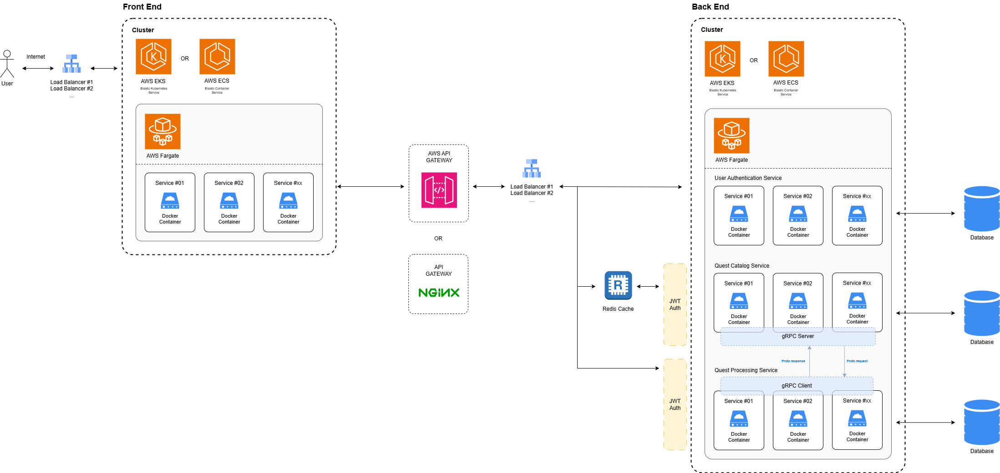
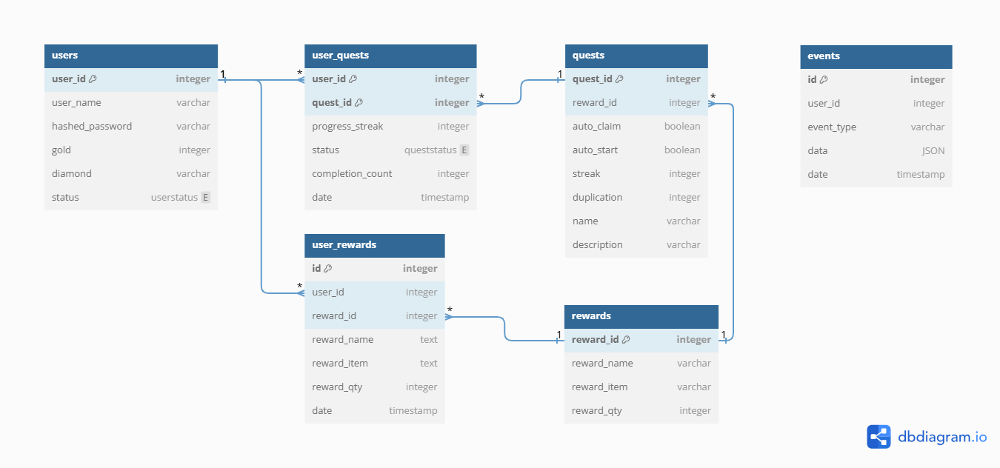

# Assignment

This assignment consists of three separate projects: three back-end projects built with Python FastAPI. To simplify sharing, all projects have been combined into a single repository. However, following best practices, each project should ideally be stored in its own separate repository.
A demo section is included at the end of this README.

# Task
### [API Request and DB Query]
Given the DB schema (see below) create an endpoint for the signup request to handle a ‘sign-in three-times’ quest. 
You should keep track of the middle actions that happen before completing a quest. 

- **Quest Name**: "Sign-in-three-times"
- **Reward**: 10 diamonds for logging in 3 times
- **Reward Claiming**: Manual (auto-claim is set to false)
- **Maximum Claims**: Reward can be claimed up to 2 times
- **Streak Requirement**: 3 logins required to claim the reward

## Server architecture

If I had access to the necessary servers and time, I would set up the architecture as outlined below. This design is based on the following considerations:
- **Traffic distribution**: Using AWS ECS (or EKS), along with Fargate, helps evenly distribute traffic and optimize resource utilization. 
- **gRPC Communication**: Implement gRPC for efficient, low-latency communication between the Quest Catalog Service and Quest Processing Service. This makes it quick to retrieve quest details and supports real-time data sharing.
- **Redis Caching for Quest Catalog Service**: Use Redis to cache frequently requested quest data, minimizing database queries and reducing latency for high-traffic requests. This improves the performance and scalability of the Quest Catalog Service by serving cached responses when possible. 
- **JWT Token for Authentication Across Services**: Use JWT (JSON Web Tokens) to authenticate requests across all services, ensuring secure, token-based access. Each service validates JWT tokens on incoming requests to enforce security and user authentication consistently.

Currently, for the demo all projects are implemented on a single server (AWS EC2 t2.micro) because I don't have separate servers available.

## Updated Database Schema

The database schema was updated with two new tables: **user_rewards** and **events**. The **user_rewards** table enables efficient retrieval of users' reward history with a single query, eliminating the need for a left join. The **events** table records key actions, such as quest completions and reward claims, allowing the state to be reconstructed from historical events.

Additional columns were also added to the tables; further details can be provided during the technical review if needed.

### Back-end : User Authentication Service

Service for user registration and login

### Back-end : Quest Catalog Service

Service for getting quest information

### Back-end : Quest Processing Service

Service for tracking user quests and managing rewards

## Contributing

Contributions are welcome! Please feel free to submit a pull request or open an issue for any suggestions or improvements.

## License

This project is licensed under the MIT License.
